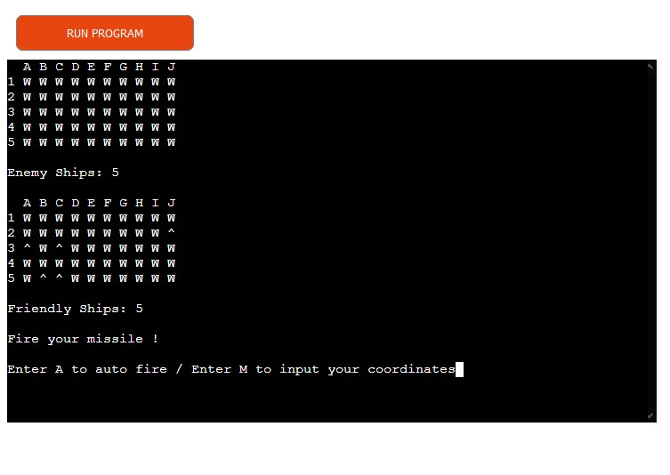
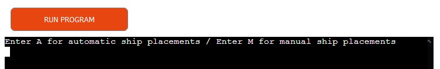
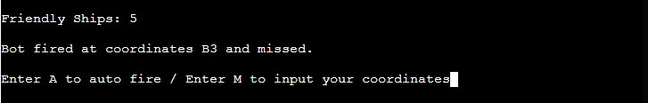
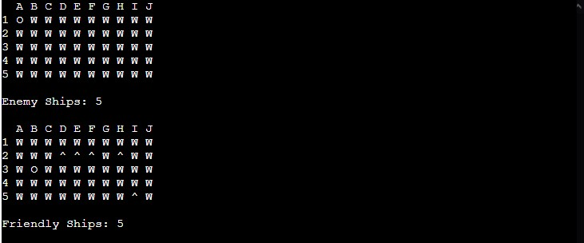
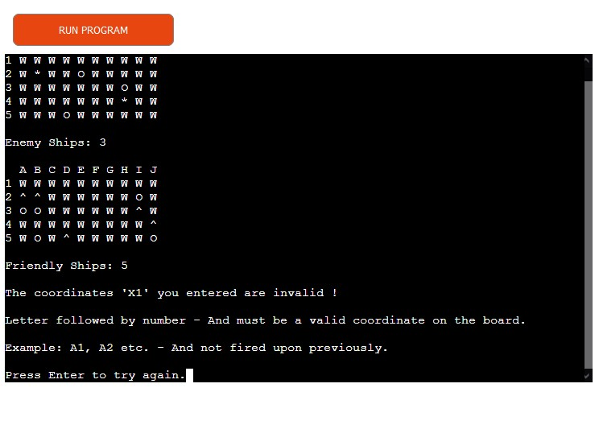
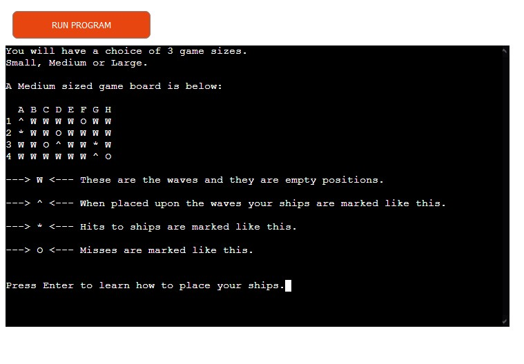
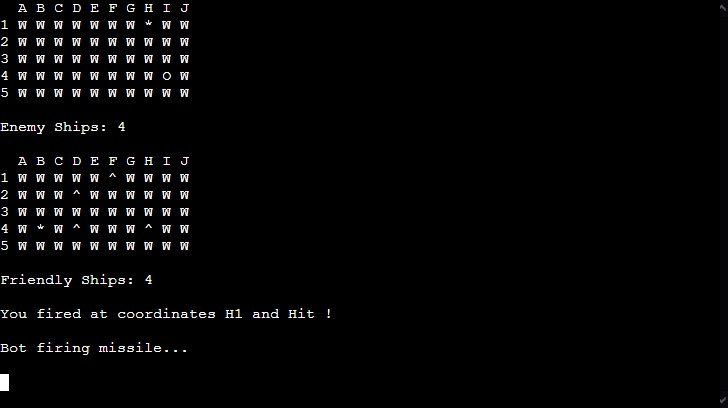

# Command Line Battleships Game

A simple command line Battleships game.

A user can play against the computer, firing missiles at guessed coordinates.

The first player to destroy all of the enemy's ships is declared the winner.

## Game Features

- **Automatic or manual ship placements**

  - A user can choose to automatically place their ships.
  - A user can choose to manually place their ships.

  

- **Automatic or manual fire**

  - A user can choose to automatically fire their missile.
  - A user can choose to manually fire their missile.

- **Scoreboard**

  - A scoreboard keeps track of each of the players ships.

- **Coordinate validation checker**

   - Ensures users can only enter valid coordinates on the board.

- **Rules**

  - A rules section explains how the game works.

- **Time based turns**

  - The game alternates between player and computer in a timed fashion, generating some suspense..
  - Information relating to the last shot is maintained between turns.

- ### **Future features**
  - Round scores.
  - More interesting presentation.

- ### **Unfixed bugs**
  - None.

- ### **Target Audiences**

  - Battleships fanatics.
  - Gaming addicts with defective graphics cards.

- ### **Design**

  - The game is based on two classes.
  - The Battleships class builds game boards and is an instance of both a player and their board.
  - The Play class is used to pit the Battleships classes against one another and to display in game information and choices.
  - There is error checking on the coordinates entered by a user for firing and ship placements only.
  - I chose to force inputs in the main so that the game has a decent pace. 

- ### **Testing**

  - Tested in my local terminal and the Code Institute Heroku terminal.
  - Cannot enter invalid coordinates for a board.
  - I tested that all of the features perform as intended.

- ### **Validator Testing**

- PEP8
  - No errors when checked on - https://www.pythonchecker.com/

  

- ### **Deployment**

  - Code Institute Python essentials template required.
  - Create a new Heroku app.
  - Set the buildpacks to Python and NodeJS in that order.
  - Link the Heroku app to the repository.
  - Click deploy.  

- The Github link can be found here - https://github.com/D-Mona/D_Mona_Battleships
- the Heroku link can be found here - https://dmonabattleships-9dbe2def89dc.herokuapp.com/
